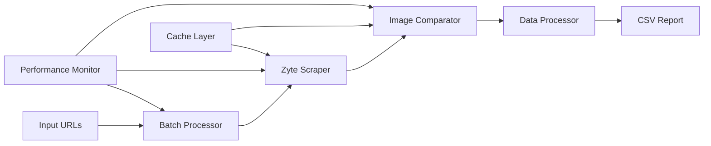

# 🚀 Product Comparison Tool - Zyte-Powered Edition

A high-performance product comparison system that identifies and compares competing products for e-commerce listings with Zyte-powered scraping capabilities, intelligent caching, and comprehensive performance monitoring.

## ✨ **Key Features**

### **🔍 Zyte-Powered Scraping System**
- **Primary**: `httpResponseBody` (fast, best for most sites)
- **Fallback**: `browserHtml` (JavaScript rendering for JS-heavy sites)
- **Automatic fallback**: Seamlessly switches to JS rendering when needed
- **Structured data extraction**: Leverages Zyte's AI-powered product data extraction
- **High success rate**: Superior image and attribute extraction compared to traditional methods

### **⚡ Batch Processing**
- Process 5+ URLs concurrently with rate limiting
- Intelligent batching with configurable batch sizes
- Automatic retry and error handling
- Progress tracking and logging

### **💾 Smart Caching**
- **SERP Results**: 1-hour cache TTL for search results
- **Image Hashes**: 2-hour cache TTL for image comparisons
- Automatic cache cleanup and memory management
- Cache hit rate monitoring and optimization

### **📊 Performance Monitoring**
- Real-time performance metrics and analytics
- Response time percentiles (P50, P95, P99)
- Zyte method usage tracking and success rates
- Web dashboard for system monitoring

## 🏗️ **Architecture**



## 🚀 **Performance Improvements**

- **Simplified Architecture**: Single scraping method with intelligent fallback
- **Better Data Quality**: Zyte's AI-powered extraction vs. manual CSS selectors
- **Reduced Maintenance**: No more site-specific selector updates
- **Consistent Results**: Same extraction logic across all sites
- **Higher Success Rate**: Superior image and attribute extraction

## 📋 **Installation**

### **1. Clone and Install**
```bash
git clone <repository-url>
cd product-compare
npm install
```

### **2. Environment Configuration**
```bash
cp env.example .env
```

Required environment variables:
```bash
# SerpAPI Configuration (Required)
SERP_API_KEY=your_serp_api_key_here

# Zyte API Configuration (Required)
ZYTE_API_KEY=your_zyte_api_key_here

# IMAGGA API Configuration (Required for enhanced image similarity)
IMAGGA_API_KEY=your_imagga_api_key_here
IMAGGA_API_SECRET=your_imagga_api_secret_here
```

### **3. Get API Keys**
- **SerpAPI**: [https://serpapi.com/](https://serpapi.com/) - Free tier available
- **Zyte**: [https://app.zyte.com/](https://app.zyte.com/) - Paid service for high-quality scraping
- **IMAGGA**: [https://imagga.com/](https://imagga.com/) - Free tier available

## 🚀 **Usage**

### **Start the Server**
```bash
npm start
```

### **Compare Products**
```bash
curl -X POST http://localhost:3000/compare \
  -H "Content-Type: application/json" \
  -d '{
    "baseUrl": "https://example.com/product1",
    "competitorUrls": [
      "https://competitor1.com/product1",
      "https://competitor2.com/product1"
    ]
  }'
```

### **Batch Processing**
```bash
curl -X POST http://localhost:3000/compare/batch \
  -H "Content-Type: application/json" \
  -d '{
    "urls": [
      {
        "baseUrl": "https://example.com/product1",
        "competitorUrls": ["https://competitor1.com/product1"]
      },
      {
        "baseUrl": "https://example.com/product2",
        "competitorUrls": ["https://competitor2.com/product2"]
      }
    ]
  }'
```

## 🔧 **Configuration**

### **Zyte Scraping Options**
```bash
# Geographic targeting
ZYTE_COUNTRY=US

# Budget limits
ZYTE_DAILY_BUDGET=50
ZYTE_HOURLY_LIMIT=100
```

### **Similarity Thresholds**
```bash
# Overall similarity threshold
SIMILARITY_THRESHOLD=0.4

# Image vs text weights
IMAGE_WEIGHT=0.6
TEXT_WEIGHT=0.4
```

## 📊 **Output**

The system generates comprehensive CSV reports with:

- **Base Product Data**: Title, image, brand, price, SKU, MPN, etc.
- **Competitor Analysis**: Similarity scores, image comparisons, attribute matching
- **Extraction Metadata**: Method used, confidence scores, processing timestamps
- **Performance Metrics**: Response times, success rates, error tracking

## 🆘 **Troubleshooting**

### **Common Issues**

1. **Zyte API Key Missing**
   ```
   Error: Zyte API key not configured
   Solution: Set ZYTE_API_KEY in your .env file
   ```

2. **Rate Limiting**
   ```
   Error: Too many requests
   Solution: Increase ZYTE_HOURLY_LIMIT or add delays
   ```

3. **Budget Exceeded**
   ```
   Error: Daily budget exceeded
   Solution: Increase ZYTE_DAILY_BUDGET or monitor usage
   ```

### **Performance Optimization**

- **Batch Size**: Adjust based on your Zyte plan limits
- **Caching**: Monitor cache hit rates and adjust TTL values
- **Similarity Thresholds**: Balance accuracy vs. result count

## 📈 **Monitoring**

### **Performance Dashboard**
Access real-time metrics at `/metrics` endpoint:

- Request success rates
- Response time percentiles
- Zyte method usage statistics
- Cache performance metrics

### **Log Analysis**
Monitor logs for:
- Scraping success/failure rates
- Zyte method selection patterns
- Performance bottlenecks
- Error patterns and solutions

## 🔮 **Future Enhancements**

- **Advanced Zyte Features**: Custom extraction rules, geographic targeting
- **Machine Learning**: Improved similarity scoring algorithms
- **Real-time Updates**: Live product monitoring and alerts
- **API Rate Optimization**: Intelligent request scheduling

## 📄 **License**

ISC License - see LICENSE file for details.

---

**Note**: This system now uses Zyte as the primary scraping method, providing superior data quality and reliability compared to traditional web scraping approaches.
